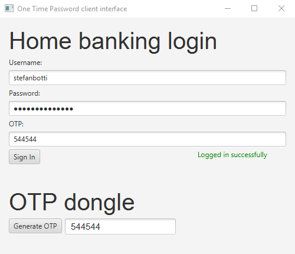
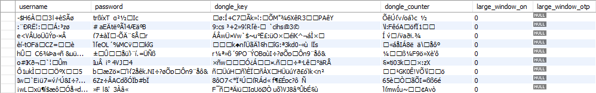
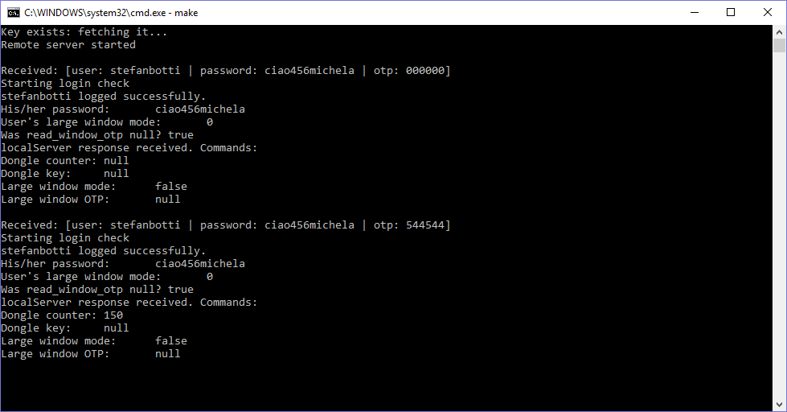

# `otp`: One Time Password
Home banking login service with One Time Password

## Project structure
This project is composed by three parts:
1. [A client-side dongle emulation](/client), used by users in order to log in
    

      
    

2. [A data access layer](/data) that manages clients' info in a secure way
    

       
    

3. [An application layer](/logic) implementing the business logic for the service
    

       
    

For further information, please read our [report](http://marcomicera.altervista.org/otp).

## Team
- [Marco Micera](https://github.com/marcomicera)
- [Riccardo Rocchi](https://github.com/riccardorocchi)
